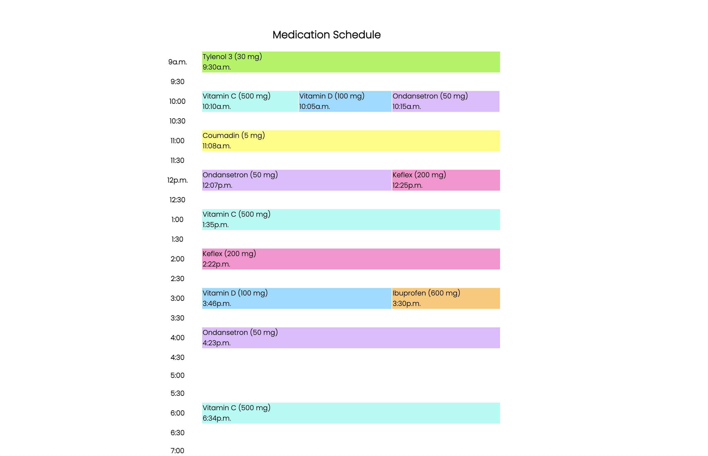

# Medication Schedule

*© 2021 Kate McCarthy*

### Purpose:
To simplify the recovery of surgical patients, I created a website called MedSched. MedSched makes tracking post-op medications a breeze.

### How it works:
Patients enter as many medications as they need and schedule the times to take each. After clicking "Create Schedule," MedSched generates a medication schedule with visible labels and bright colors on a printable timetable. I am  planning on publishing the website.

### Programming Languages:
HTML, CSS, Javascript, & PHP

### Source Code:
There are four files within the src folder:

- [**index.php**](src/index.php)
    - The first page of the MedSched website
    - Contains the form to enter medications
    
- [**main.css**](src/main.css)
    - Responsible for styling index.php
    
- [**time.php**](src/time.php)
    - The page that the 'Submit' button of index.php redirects to
    - Displays the timetable of medications by rearranging form input
    
- [**schedule.css**](src/schedule.css)
    - Responsible for styling time.php

### Sample Medication Schedule:

